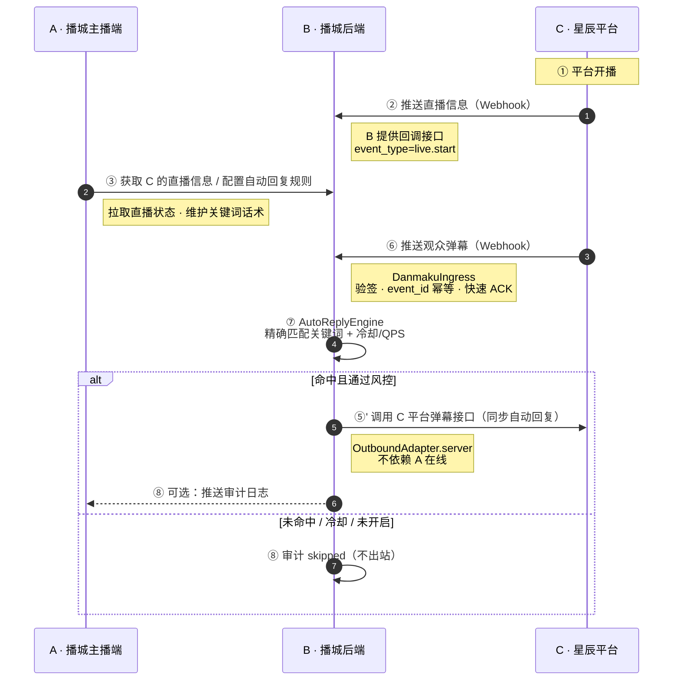
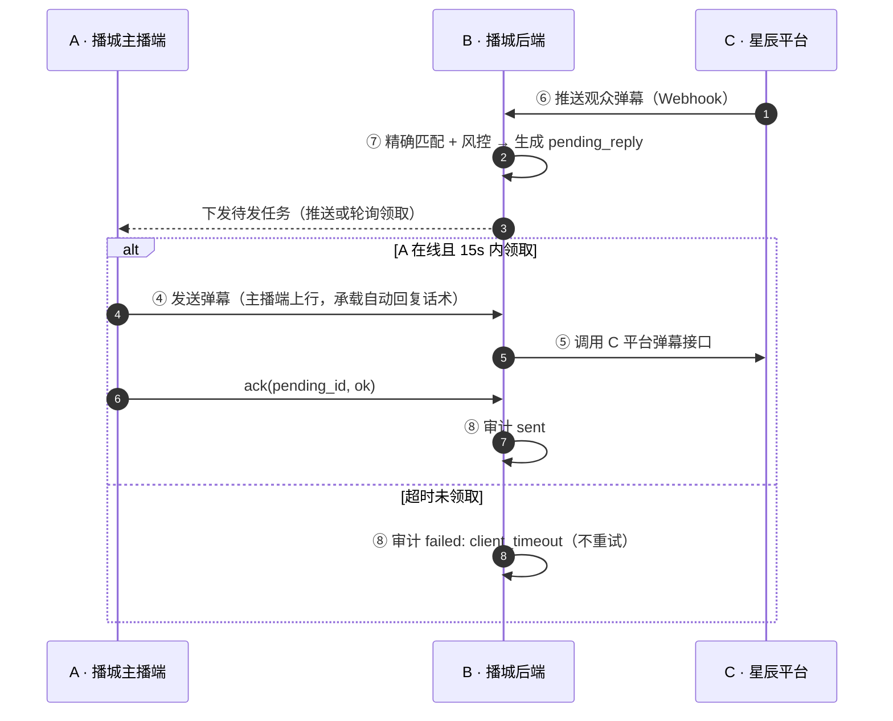

# 弹幕自动回复 · 最终版时序图

> 与 Spec `2026-11-20-danmaku-auto-reply-design.md` §3.2 一致。  
> 参与方：A 播城主播端 · B 播城后端 · C 星辰平台

## 主路径（server / auto 有凭证）

```mermaid
sequenceDiagram
    autonumber
    participant A as A · 播城主播端
    participant B as B · 播城后端
    participant C as C · 星辰平台

    Note over C: ① 平台开播
    C->>B: ② 推送直播信息（Webhook）
    Note right of B: B 提供回调接口<br/>event_type=live.start
    A->>B: ③ 获取 C 的直播信息 / 配置自动回复规则
    Note right of A: 拉取直播状态 · 维护关键词话术

    C->>B: ⑥ 推送观众弹幕（Webhook）
    Note right of B: DanmakuIngress<br/>验签 · event_id 幂等 · 快速 ACK
    B->>B: ⑦ AutoReplyEngine<br/>精确匹配关键词 + 冷却/QPS
    alt 命中且通过风控
        B->>C: ⑤' 调用 C 平台弹幕接口（同步自动回复）
        Note right of B: OutboundAdapter.server<br/>不依赖 A 在线
        B-->>A: ⑧ 可选：推送审计日志
    else 未命中 / 冷却 / 未开启
        B->>B: ⑧ 审计 skipped（不出站）
    end
```

## 降级路径（client / auto 无凭证）

```mermaid
sequenceDiagram
    autonumber
    participant A as A · 播城主播端
    participant B as B · 播城后端
    participant C as C · 星辰平台

    C->>B: ⑥ 推送观众弹幕（Webhook）
    B->>B: ⑦ 精确匹配 + 风控 → 生成 pending_reply
    B-->>A: 下发待发任务（推送或轮询领取）
    alt A 在线且 15s 内领取
        A->>B: ④ 发送弹幕（主播端上行，承载自动回复话术）
        B->>C: ⑤ 调用 C 平台弹幕接口
        A->>B: ack(pending_id, ok)
        B->>B: ⑧ 审计 sent
    else 超时未领取
        B->>B: ⑧ 审计 failed: client_timeout（不重试）
    end
```
